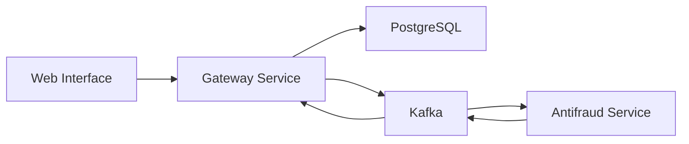

# FC Pay Web Interface

[](https://nextjs.org) [](https://www.typescriptlang.org) [](https://tailwindcss.com) [](https://opensource.org/licenses/MIT)

A modern web interface for the FC Pay payment gateway system, built with Next.js and TypeScript. This project is part of a microservices architecture study, focusing on best practices and modern web development patterns.

## Table of Contents

- [Project Origin](#project-origin)
- [Features](#features)
- [Architecture](#architecture)
- [Getting Started](#getting-started)
- [Main Screens](#main-screens)
- [Business Rules](#business-rules)
- [Study Focus](#study-focus)
- [Related Projects](#related-projects)
- [License](#license)

## Project Origin

This project is an evolution of the [Payment Gateway Frontend](https://github.com/devfullcycle/imersao22/tree/main/next-frontend) developed during the Full Stack & Full Cycle Immersion course. 

This project was created for educational purposes to:
- Deepen my understanding of Next.js and modern React patterns
- Explore and implement best practices in frontend development
- Experiment with different architectural patterns
- Add new features and improvements
- Create a more production-ready version

This is a personal learning journey to enhance my skills in frontend development, user experience, and modern web technologies.

## Features

| Feature | Description |
|---------|-------------|
| 🔐 Authentication | API key-based authentication system |
| 💳 Payment Processing | Credit card payment processing interface |
| 📊 Invoice Management | List, create and view invoice details |
| 🎨 Modern UI | Clean and responsive design using Tailwind CSS |
| 🔄 Real-time Updates | Server-side revalidation for data updates |
| 📱 Responsive Design | Mobile-first approach for all screens |

## Architecture

### Tech Stack

| Component | Technology |
|-----------|------------|
| Frontend | Next.js 14 |
| UI Components | Shadcn UI |
| Form Validation | Zod |

### System Components



## Getting Started

### Prerequisites

| Requirement | Version | Purpose |
|-------------|---------|---------|
| Node.js | 18.17+ | Runtime Environment |
| Docker | Latest | Containerization |
| Docker Compose | Latest | Service Orchestration |
| Running Gateway Service | Required | Backend Integration |

### Installation Steps

1. **Start the Gateway Service first**
   ```bash
   cd ../fc-pay-gateway
   docker-compose up -d
   ```

2. **Clone the repository**
   ```bash
   git clone https://github.com/brunownk/fc-pay-web.git
   cd fc-pay-web
   ```

3. **Set up environment variables**
   ```bash
   cp .env.example .env
   # The default environment variables are already configured for Docker
   ```

4. **Start the service**
   ```bash
   docker compose up -d
   ```

5. **Verify the service is running**
   ```bash
   docker compose ps
   ```

### Docker Network Configuration

The web service connects to the `fc-pay-network` created by the gateway service. The network configuration includes:

- Gateway API: `http://app:8080` (internal Docker network)
- Web Interface: `http://localhost:3000` (host machine)

### Service Dependencies

The web service depends on:
- The gateway service (for API communication)
- Next.js 14 (for the web interface)

### Health Checks

You can verify the service is healthy by:

1. **Web Interface**
   ```bash
   curl http://localhost:3000
   ```

2. **API Connection**
   ```bash
   curl http://localhost:3000/api/health
   ```

### Development Mode

To run the service in development mode:

```bash
# Access the container shell
docker compose exec nextjs bash

# Install dependencies
npm install

# Start the development server
npm run dev
```

## Main Screens

| Screen | Description | Learning Focus |
|--------|-------------|----------------|
| 🔑 Login | API key authentication | Authentication Patterns |
| 📋 Invoice List | Overview of all transactions | Data Fetching, State Management |
| 📝 Invoice Details | Detailed transaction information | Component Composition |
| ➕ Create Invoice | Payment processing form | Form Handling, Validation |

## Business Rules

| Rule | Description | Implementation Focus |
|------|-------------|----------------------|
| 💰 Amount Threshold | Transactions over $10,000 require manual review | Business Logic |
| 🔄 Status Updates | Real-time status updates via revalidation | State Management |
| 🎨 Status Colors | Green (approved), Yellow (pending), Red (rejected) | UI/UX Design |

## Study Focus

| Topic | Description |
|-------|-------------|
| 🏗️ Next.js 14 | Testing new features and patterns, App Router, Server/Client Components |
| 🔄 SSR/CSR | Understanding rendering strategies, Server-side vs Client-side rendering |
| 🎨 UI/UX | Modern design patterns, User Experience, Responsive Design |
| 📱 Mobile First | Cross-platform development, Responsive layouts, Touch interactions |

## Related Projects

| Project | Description | Learning Context |
|---------|-------------|------------------|
| [Main Repository](https://github.com/brunownk/fc-pay) | Core project repository | System Architecture |
| [Gateway Service](https://github.com/brunownk/fc-pay-gateway) | Payment processing API | Backend Integration |
| [Antifraud Service](https://github.com/brunownk/fc-pay-antifraud) | Fraud detection service | Microservices |

## License

This project is licensed under the MIT License - see the [LICENSE](LICENSE) file for details.