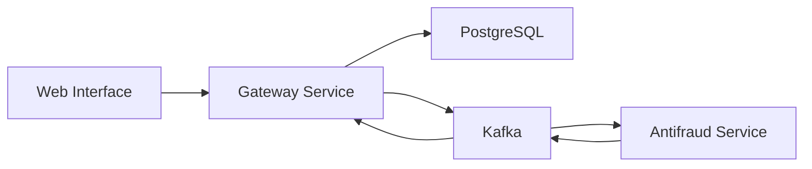

# FC Pay Web Interface

[](https://nextjs.org) [](https://www.typescriptlang.org) [](https://tailwindcss.com) [](https://opensource.org/licenses/MIT)

A modern web interface for the FC Pay payment gateway system, built with Next.js and TypeScript. This project is part of a microservices architecture study, focusing on best practices and modern web development patterns.

## Table of Contents

- [Project Origin](#project-origin)
- [Features](#features)
- [Architecture](#architecture)
- [Getting Started](#getting-started)
- [Main Screens](#main-screens)
- [Business Rules](#business-rules)
- [Study Focus](#study-focus)
- [Related Projects](#related-projects)
- [License](#license)

## Project Origin

This project is an evolution of the [Payment Gateway Frontend](https://github.com/devfullcycle/imersao22/tree/main/next-frontend) developed during the Full Stack & Full Cycle Immersion course. 

This project was created for educational purposes to:
- Deepen my understanding of Next.js and modern React patterns
- Explore and implement best practices in frontend development
- Experiment with different architectural patterns
- Add new features and improvements
- Create a more production-ready version

This is a personal learning journey to enhance my skills in frontend development, user experience, and modern web technologies.

## Features

| Feature | Description |
|---------|-------------|
| 🔐 Authentication | API key-based authentication system |
| 💳 Payment Processing | Credit card payment processing interface |
| 📊 Invoice Management | List, create and view invoice details |
| 🎨 Modern UI | Clean and responsive design using Tailwind CSS |
| 🔄 Real-time Updates | Server-side revalidation for data updates |
| 📱 Responsive Design | Mobile-first approach for all screens |

## Architecture

### Tech Stack

| Component | Technology |
|-----------|------------|
| Frontend | Next.js 14 |
| UI Components | Shadcn UI |
| Form Validation | Zod |

### System Components



## Getting Started

### Prerequisites

| Requirement | Version | Purpose |
|-------------|---------|---------|
| Node.js | 18+ | Runtime Environment |
| Docker | Latest | Containerization |
| Docker Compose | Latest | Service Orchestration |
| FC Pay Gateway | Running | API & Transaction Processing |
| FC Pay Antifraud | Running | Fraud Detection |

### Installation Steps

1. **Clone the repository**
   ```bash
   git clone https://github.com/brunownk/fc-pay-web.git
   cd fc-pay-web
   ```

2. **Configure environment**
   ```bash
   cp .env.example .env
   # The default environment variables are already configured for Docker
   ```

3. **Verify Required Services**

   > ⚠️ **Important**: Both Gateway and Antifraud services must be running and healthy before starting the Web interface.
   > The Web interface depends on APIs and Kafka topics from both services.

   ```bash
   # Check Gateway health
   curl http://localhost:8080/health
   # Expected: {"status":"ok"}

   # Check Antifraud health
   curl http://localhost:3001/health
   # Expected: {"status":"ok"}
   ```

4. **Start the service**
   ```bash
   docker-compose up -d
   ```

5. **Verify service health**
   ```bash
   # Check container status
   docker-compose ps
   # Expected: fc-pay-web-app-1 ... (healthy)

   # Check service logs
   docker-compose logs -f app
   # Look for: "Server started" and "Connected to API"

   # Access the web interface
   open http://localhost:3000
   ```

### Features

The Web interface provides:
- Transaction dashboard
- Real-time transaction monitoring
- Fraud detection status
- Account management
- Transaction history
- Analytics and reporting

### Development

For local development:

1. **Install dependencies**
   ```bash
   npm install
   ```

2. **Start in development mode**
   ```bash
   npm run dev
   ```

3. **Build for production**
   ```bash
   npm run build
   npm start
   ```

### Troubleshooting

1. **API Connection Issues**
   ```bash
   # Check Gateway API
   curl http://localhost:8080/health
   
   # Check Antifraud API
   curl http://localhost:3001/health
   ```

2. **Common Error Messages**

   - "Error: Cannot connect to Gateway API"
     - Verify Gateway service is running
     - Check network connectivity
     - Ensure environment variables are correct

   - "Error: Cannot connect to Antifraud API"
     - Verify Antifraud service is running
     - Check network connectivity
     - Ensure environment variables are correct

   - "Error: Authentication failed"
     - Check API credentials in .env file
     - Verify token expiration
     - Clear browser cache and cookies

3. **UI Issues**
   - Clear browser cache
   - Check console for JavaScript errors
   - Verify all required environment variables are set
   - Check browser compatibility (latest Chrome/Firefox/Safari recommended)

### Environment Variables

| Variable | Description | Default |
|----------|-------------|---------|
| PORT | Service port | 3000 |
| GATEWAY_API_URL | Gateway service URL | http://localhost:8080 |
| ANTIFRAUD_API_URL | Antifraud service URL | http://localhost:3001 |
| NODE_ENV | Environment mode | development |

### Browser Support

The web interface is tested and supported on:
- Chrome (latest)
- Firefox (latest)
- Safari (latest)
- Edge (latest)

### Security Considerations

1. **Authentication**
   - Uses JWT tokens for API authentication
   - Implements session management
   - Supports role-based access control

2. **Data Protection**
   - All API calls use HTTPS in production
   - Sensitive data is never stored in local storage
   - Automatic session timeout

3. **Best Practices**
   - Regular security updates
   - Input validation
   - XSS protection
   - CSRF protection

## Main Screens

| Screen | Description | Learning Focus |
|--------|-------------|----------------|
| 🔑 Login | API key authentication | Authentication Patterns |
| 📋 Invoice List | Overview of all transactions | Data Fetching, State Management |
| 📝 Invoice Details | Detailed transaction information | Component Composition |
| ➕ Create Invoice | Payment processing form | Form Handling, Validation |

## Business Rules

| Rule | Description | Implementation Focus |
|------|-------------|----------------------|
| 💰 Amount Threshold | Transactions over $10,000 require manual review | Business Logic |
| 🔄 Status Updates | Real-time status updates via revalidation | State Management |
| 🎨 Status Colors | Green (approved), Yellow (pending), Red (rejected) | UI/UX Design |

## Study Focus

| Topic | Description |
|-------|-------------|
| 🏗️ Next.js 14 | Testing new features and patterns, App Router, Server/Client Components |
| 🔄 SSR/CSR | Understanding rendering strategies, Server-side vs Client-side rendering |
| 🎨 UI/UX | Modern design patterns, User Experience, Responsive Design |
| 📱 Mobile First | Cross-platform development, Responsive layouts, Touch interactions |

## Related Projects

| Project | Description | Learning Context |
|---------|-------------|------------------|
| [Main Repository](https://github.com/brunownk/fc-pay) | Core project repository | System Architecture |
| [Gateway Service](https://github.com/brunownk/fc-pay-gateway) | Payment processing API | Backend Integration |
| [Antifraud Service](https://github.com/brunownk/fc-pay-antifraud) | Fraud detection service | Microservices |

## License

This project is licensed under the MIT License - see the [LICENSE](LICENSE) file for details.